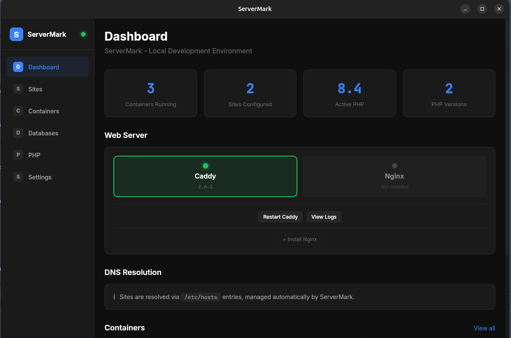
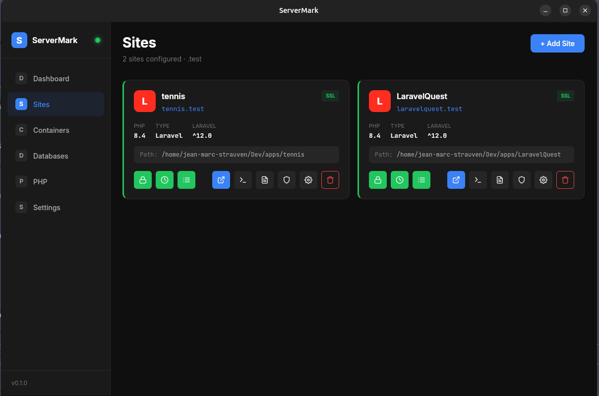
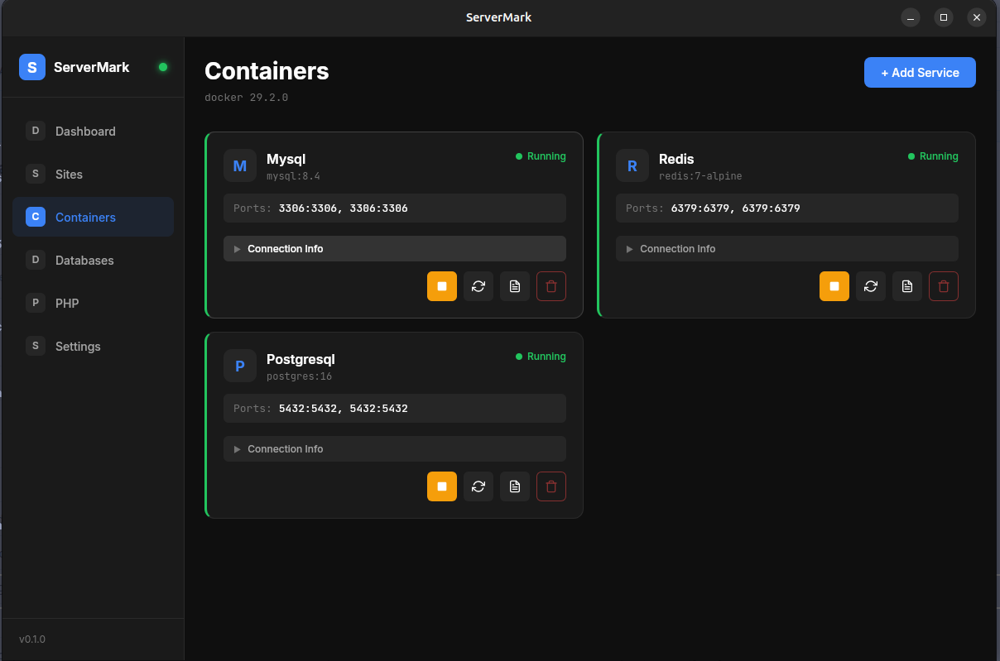

# ServerMark

Local development environment manager for Linux - A Herd/Valet alternative.


> **Warning**
> This is a **beta version**. Features may be incomplete or change without notice. Use at your own risk in development environments only.

## Overview

ServerMark is a desktop application for managing local development environments on Linux. It provides an easy-to-use graphical interface for managing services, PHP versions, and development sites.

## Screenshots

### Dashboard


### Sites Management


### Containers (Docker)


### PHP Versions


## Features

### Web Server
- **Caddy/Nginx Support** - Install and manage web servers
- **Automatic SSL** - One-click HTTPS for local sites via mkcert
- **Custom Domains** - Use `.test` or any TLD for local development

### Site Management
- **Multi-type Sites** - Laravel, Symfony, WordPress, Static, Proxy
- **PHP Version per Site** - Assign specific PHP version to each site
- **Auto-detection** - Automatically detects project type and framework version

### Laravel Integration
- **Version Detection** - Shows current and latest Laravel version
- **Scheduler Management** - Enable/disable Laravel scheduler via crontab
- **Queue Worker** - Start/stop queue workers via systemd user services
- **Logs Viewer** - View scheduler and queue worker logs in real-time
- **Permissions Fix** - One-click fix for storage/cache permissions
- **Upgrade Notifications** - Get notified when Laravel updates are available

### Container Services (Docker/Podman)
- **Database Servers** - MySQL, MariaDB, PostgreSQL, MongoDB
- **Caching** - Redis, Memcached
- **Tools** - Mailpit, MinIO, Adminer
- **Easy Management** - Start/stop/restart with connection info

### Database Management
- **Create Databases** - Create databases on MySQL/PostgreSQL containers
- **Connection Info** - Quick access to credentials and connection strings

### PHP Management
- **Multiple Versions** - PHP 8.4, 8.3, 8.2, 8.1, 8.0, 7.4, 7.3, 7.2
- **One-click Install** - Install PHP versions with extension selection
- **Global Switch** - Change active PHP version system-wide

### System
- **System Tray** - Quick access from the system tray
- **Multi-distro Support** - Ubuntu, Debian, Fedora, Arch, and more
- **Native Integration** - Uses system package manager (apt, dnf, pacman)

## Tech Stack

- **Frontend**: Vue 3 + TypeScript + Vite + Pinia
- **Backend**: Rust + Tauri 2
- **Target**: Linux (Ubuntu, Debian, Fedora, Arch, etc.)

## Requirements

- Linux (Ubuntu 20.04+, Debian 11+, Fedora 38+, Arch)
- Docker or Podman (for containerized services)
- Rust 1.77+ (for building)
- Node.js 18+ (for building)

## Installation

### From Source

```bash
# Clone the repository
git clone https://github.com/Grazulex/servermark.git
cd servermark

# Install dependencies
npm install

# Run in development mode
npm run tauri:dev

# Build for production
npm run tauri:build
```

## Project Structure

```
servermark/
├── src/                    # Vue 3 frontend
│   ├── views/              # Page components
│   ├── components/         # Reusable components
│   ├── stores/             # Pinia state management
│   ├── composables/        # Vue 3 composition API hooks
│   ├── types/              # TypeScript types
│   └── styles/             # Global CSS
├── src-tauri/              # Rust backend
│   ├── src/
│   │   ├── commands/       # Tauri commands
│   │   ├── main.rs
│   │   └── lib.rs
│   └── Cargo.toml
└── package.json
```

## Development

```bash
# Install dependencies
npm install

# Run in development mode
npm run tauri:dev

# Type check and lint
npm run check

# Format code
npm run format
```

## Supported Site Types

| Type | Description |
|------|-------------|
| Laravel | Full Laravel support with scheduler, queue, logs |
| Symfony | Symfony framework projects |
| WordPress | WordPress installations |
| Static | Static HTML/CSS/JS sites |
| Proxy | Reverse proxy to another URL |

## Container Services

ServerMark supports the following services via Docker/Podman:

| Service | Versions | Default Port |
|---------|----------|--------------|
| MySQL | 8.4, 8.0, 5.7 | 3306 |
| MariaDB | 11, 10 | 3306 |
| PostgreSQL | 16, 15, 14, 13 | 5432 |
| MongoDB | 7, 6, 5 | 27017 |
| Redis | 7, 6 | 6379 |
| Memcached | latest | 11211 |
| Mailpit | latest | 8025 |
| MinIO | latest | 9000/9001 |
| Adminer | latest | 8080 |

## PHP Versions

Supported PHP versions (installed via system package manager):

| Version | Status |
|---------|--------|
| PHP 8.4 | Latest |
| PHP 8.3 | LTS |
| PHP 8.2 | LTS |
| PHP 8.1 | Security fixes |
| PHP 8.0 | EOL |
| PHP 7.4 | EOL |
| PHP 7.3 | EOL |
| PHP 7.2 | EOL |

## License

MIT

## Contributing

Contributions are welcome! Please feel free to submit a Pull Request.
